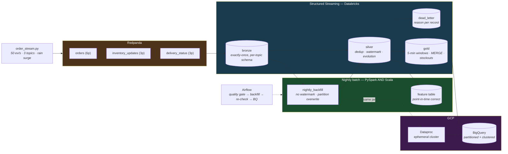

# Real-Time Quick-Commerce Operations Lakehouse (Multi-Cloud)

**Kafka (Redpanda) · Spark Structured Streaming · Delta Lake · Databricks · GCP Dataproc · BigQuery · Scala · Airflow · Great Expectations**

Blinkit's ops floor: orders stream in every second, dark stores stock out in minutes, and the dashboard must show it *now*. A streaming medallion lakehouse with exactly-once ingestion, watermarked late-event handling, a stockout detector, the same batch job in PySpark **and** Scala, and a GCP path that proves the whole thing is portable.



> **The meaningful observation:** the streaming stockout detector fires when
> projected inventory runs out within 15 minutes — while an hourly batch job would
> notice, on average, ~37 minutes later (half the batch interval plus runtime), by
> which point a 10-minute-promise dark store has been failing orders for half an
> hour. **That gap is arithmetic, not a benchmark** — this repo has not run both
> modes against a live cluster to measure it, and the honest number would come from
> doing exactly that. What *is* measured: the detector's edge cases (zero demand
> never divides by zero, at-zero alerts immediately, the 15.0-minute boundary
> alerts and 15.5 does not) — all green in CI against real Spark.

---

## What is verified, and how

No Kafka broker, Spark cluster, Databricks workspace, or GCP project is attached to
this repo. What makes the claims here more than prose is CI, which runs on every PR:

| CI job | What it actually proves |
|---|---|
| **producer** (14 tests) | Event coherence: deliveries reference real orders, stages only advance, inventory drains under load, rain surge raises volume, seeded determinism |
| **Spark transforms** (37 chispa tests, JDK 17, real Spark) | Bronze parse contract, silver validation/dedup/evolution, gold windows + all 6 stockout edge cases, backfill invariants, **the feature-table leakage guard** |
| **Scala backfill** (`sbt test`, 7 ScalaTest cases) | The Scala port compiles and passes the same invariants as the PySpark version — the "same job in two languages" claim is CI-checked, not asserted |
| **GCP** (7 loader tests + shellcheck + `terraform validate`) | BigQuery partition-decorator correctness (where an idempotent reload could become a full-table wipe), IaC validity |
| **quality** (19 tests) | The z-score anomaly logic and its edge cases; the error/warn severity split |

**Not verified without infrastructure:** the streaming queries running against a
live broker (the checkpoint/exactly-once machinery is Spark+Delta's guarantee — the
parse and transform logic feeding it is what's tested), the Dataproc submission, and
the live BigQuery load. Each is documented as a runbook/procedure, not claimed as a run.

## Quick start

```bash
pip install -r requirements.txt
pytest producer/tests quality/tests gcp/tests    # no broker, no Spark needed

# With Docker:
docker compose up -d                             # Redpanda + console + topics
docker compose run --rm producer --duration 120  # stream events
# console at http://localhost:8080 to watch the topics

# With Java + Spark:
pytest streaming/tests batch/tests ml_handoff/tests   # the chispa suites
cd batch/scala && sbt test                             # the Scala suite
```

## The design decisions that carry the repo

**Exactly-once is a three-way contract, not a config flag.** Kafka offsets as the
source of truth, a Delta sink that commits atomically, and a checkpoint tying them
together transactionally — a mid-batch crash either committed the data *and*
advanced the offset, or did neither and replays. There is no "committed the data
but lost the offset" state, which is the state that produces duplicates. It's why
the sink must be Delta and not plain parquet ([bronze_ingest.py](streaming/bronze_ingest.py)).

**The watermark is deliberately shorter than the worst-case lateness.** 10-minute
watermark vs 15-minute injected lateness, so some events *are* dropped as too-late
and the watermark does observable work. A watermark longer than the worst lateness
accepts everything and demonstrates nothing. And the dedup is
`dropDuplicatesWithinWatermark`, not `dropDuplicates` — plain dedup remembers every
event_id forever and grows state until the job dies ([silver_clean.py](streaming/silver_clean.py)).

**Schema evolution: additive yes, breaking no.** `mergeSchema` widens the table for
a new nullable column (the correct response to an upstream adding a field) but still
fails a type change or column drop — those *should* stop the pipeline. "Evolution
enabled" that accepted breaking changes would be a silent-corruption switch.

**Validation before dedup.** A malformed *duplicate* is dead-lettered as malformed
with its reason, not silently removed — deduping first would delete the second copy
before its reason was recorded. Every dead-letter row carries a specific reason
(`order_value_negative`, not "invalid"), because a table where every row says
"failed" is one nobody can act on.

**The stream and the batch write the same tables.** The backfill reprocesses a day
with no watermark and overwrites that day's partition — one table kept correct by a
fast approximate stream and a slow exact batch, not a lambda-architecture split the
consumer has to reconcile. The idempotency mechanism is the same across both clouds:
Delta dynamic partition overwrite, and BigQuery `WRITE_TRUNCATE` scoped to a
`$YYYYMMDD` decorator.

**The feature table is point-in-time correct, and there's a test that proves it.**
Every feature for day D uses data from days < D only. The leakage test changes day
D's own sales from 5 units to 500 and asserts day D's *features* don't move — if
they did, the features leak the label, and the model looks brilliant in training
and falls apart in production. Nulls stay null (zero is an observed "nobody
bought"; null is "no data" — encoding unknown as 0 teaches a model that new SKUs
have zero demand, exactly backwards for a launch). Consumed by
[quickcommerce-demand-intelligence](https://github.com/chinmayharjai/quickcommerce-demand-intelligence).

## Time travel

Delta keeps table versions, so yesterday's gold is a query, not a restore:

```sql
-- What did the zone aggregates say yesterday, before today's backfill corrected them?
SELECT * FROM delta.`data/lakehouse/gold_orders_by_zone_5min`
TIMESTAMP AS OF date_sub(current_date(), 1);

-- Or diff two versions of the stockout alerts:
SELECT * FROM delta.`data/lakehouse/stockout_alerts` VERSION AS OF 42
EXCEPT ALL
SELECT * FROM delta.`data/lakehouse/stockout_alerts` VERSION AS OF 41;
```

The practical use here: the nightly backfill *changes* gold retroactively, and time
travel is how you answer "did the dashboard's 9am number differ from what the
backfill later said?" — the streaming/batch reconciliation made visible.

## Data governance

| Contract | Where it lives | Enforced by |
|---|---|---|
| Event schema (per topic) | `streaming/bronze_ingest.py` explicit `StructType`s | `from_json` — off-contract fields null out, tested |
| Validity rules | `streaming/silver_clean.py` named predicates | Dead-letter routing with a reason per record |
| Schema evolution policy | additive-only; breaking changes fail the write | Delta `mergeSchema` semantics, both directions tested |
| Dead-letter policy | nothing is silently dropped; every reject carries a reason and timestamp | `test_validation_routes_not_drops` |
| Feature contract | grain, freshness, point-in-time, null semantics — stated in `ml_handoff/feature_table.py` | The leakage test |
| Table ownership | bronze/silver/gold: data platform · feature table: shared with ML · BigQuery copies: disposable serving | this README |

## Repository map

| Path | What's there |
|---|---|
| [`producer/`](producer/order_stream.py) | Coherent 3-topic event generator, rain surge, lateness injection — pure logic, 14 tests |
| [`streaming/`](streaming/) | bronze (exactly-once) → silver (dedup/watermark/evolution/dead-letter) → gold (windows, MERGE, stockouts) |
| [`batch/`](batch/README.md) | The backfill in PySpark **and** Scala, same tests both sides |
| [`gcp/`](gcp/README.md) | Terraform, ephemeral Dataproc submit, partitioned BigQuery load, trial teardown |
| [`quality/`](quality/expectations/suites.py) | Freshness, two-sided z-score volume anomaly, null/range — pure logic, 19 tests |
| [`airflow/`](airflow/dags/batch_backfill_dag.py) | Quality gate → backfill → re-check → BigQuery, idempotency documented |
| [`ml_handoff/`](ml_handoff/feature_table.py) | Point-in-time-correct demand features + the leakage test |
| [`runbooks/`](runbooks/) | Consumer lag, backfill OOM, alert flood — each with differential diagnosis and a what-NOT-to-do |

## Milestones

Each was one PR; the merged PRs are the build history.

| # | Milestone | PR |
|---|---|---|
| M1 | Redpanda + producer | [#1](../../pull/1) |
| M2 | Streaming bronze (exactly-once) | [#2](../../pull/2) |
| M3 | Streaming silver (watermark, evolution, dead-letter) | [#3](../../pull/3) |
| M4 | Streaming gold + stockout detector | [#4](../../pull/4) |
| M5 | Backfill in PySpark AND Scala | [#5](../../pull/5) |
| M6 | GCP path (Dataproc + BigQuery) | [#6](../../pull/6) |
| M7 | Quality + Airflow + runbooks | [#7](../../pull/7) |
| M8 | ML handoff + this README | [#8](../../pull/8) |

## Honest limitations

- **The streaming queries have never run against a live broker here.** The parse
  and transform logic is chispa-tested on real Spark in CI; the checkpoint and
  exactly-once machinery is Spark+Delta's documented guarantee. Running
  `docker compose up` + the producer + the three streaming jobs on a machine with
  Docker and Java is the remaining step, and the repo is built so that's one
  command each.
- **The "faster than batch" claim is arithmetic** (streaming detects within its
  5-minute window vs an hourly batch's average ~37-minute lag), not a measured A/B.
  Measuring it for real means running both modes against the same replayed surge.
- **The stockout projection is linear extrapolation** of the recent rate — the
  detection mechanism and its edge cases are the point; a production system would
  smooth or forecast demand (which is what the companion ML repo does).
- **The demand data is synthetic**, so the same caveat as the other repos applies:
  the dead-letter and anomaly checks catch defect shapes I injected and know about.
